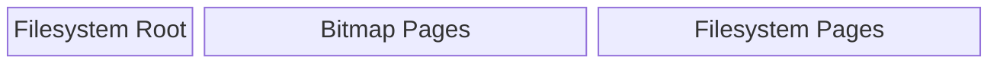

# STORfs Bitmap

The bitmap tracks which pages in persistent memory are allocated or free.
A bitmap is used because it has a fixed memory footprint and requires no dynamic allocation,
making it well suited for embedded systems with constrained resources.

Each bit represents the state of a single page:

```math
b_i = \left\lbrace \begin{array}{ll} 1 & \text{if page } i \text{ is allocated} \\
0 & \text{if page } i \text{ is free} \end{array} \right.
```

For example, a byte value of `0b11000111` means pages 0, 1, 2, 6, and 7 are allocated
while pages 3, 4, and 5 are free.

The bitmap is stored within the filesystem
so that it can be retrieved every time the system is booted.

## Storage

A reserved number of pages in the filesystem store the bitmap.
The memory layout is illustrated below:



- **Filesystem Root**:
  - Reserved page that holds information about the root directory
- **Bitmap Pages**:
  - Pages that track which **Filesystem Pages** are free and which are allocated
- **Filesystem Pages**:
  - Pages used for files and directories

The number of pages reserved for the bitmap is calculated as follows:

```math
n_p = \left\lceil \frac{p_c}{8p_s} \right\rceil
```

- $$n_p$$: Number of bitmap pages
  - Number of reserved pages for the bitmap
- $$p_c$$: Page count
  - Total number of pages in the filesystem
- $$p_s$$: Page size
  - Size of each page in bytes

The page count is divided by 8 to convert from bits to bytes (since each bit represents one page),
then divided by the page size and rounded up (ceiling division) to determine
the total number of pages needed to store the bitmap.

## Initialization

Upon creating the filesystem,
the bitmap is created and stored as described above.
The initial pages used for the bitmap and root page are marked as allocated:

```math
b_a = n_p + p_r
```

- $$b_a$$: Pages allocated during filesystem creation
- $$n_p$$: Number of bitmap pages
- $$p_r$$: Root page (holds information for the root directory)

When the filesystem is mounted,
the next free page is found and stored into a hint variable described in the following section.

## Hint

The hint is a stored reference to the last known free page position,
used as the starting point for the next search.
This avoids scanning from the beginning of the bitmap on every allocation,
effectively amortizing the cost of repeated allocations to $$O(1)$$.

The hint is updated after each discovery, allocation, or free operation:

- **Discovery**
  - Finds the first available page in the bitmap and sets the hint to that page
- **Allocation**
  - Uses the hint to find the first available page,
  marks all requested pages (single or contiguous) as allocated,
  and then updates the hint to the page following the last allocated page
- **Free**
  - On a successful free, the hint is set to the freed page

The search uses a circular scan starting from the hint,
wrapping back to the beginning after reaching the last page:

```math
p_{\text{next}} = (p_{\text{current}} + s) \mod p_c
```

Where $s$ is the step size (1 for bit-level, 8 for byte-level processing) and $p_c$ is the total page count.
This ensures all pages are examined regardless of where the hint starts.
If the search wraps fully back to the starting position without finding a free page,
the filesystem is full.

When comparing the hint to a naive search from the beginning of the bitmap,
where $k$ is the number of allocated pages before the first free page and $n$ is the total page count:

```math
\begin{array}
\text{Without hint: } O(k) \\
\text{With hint: } O(1) \quad \text{(best case)} \\
\text{Worst case: } O(n) \quad \text{(both)}
\end{array}
```

## Operations

Four operations are available to access the bitmap:

- **Get** - Determine if a page is free or allocated
- **Discover** - Find the next available page(s)
- **Alloc** - Mark the next available page(s) as allocated
- **Free** - Mark the specified page(s) as free

These operations support both individual and contiguous pages.
Contiguous operations allocate or free multiple consecutive pages for file data,
while single-page operations handle cases that do not require contiguous access.

## Optimizations

When processing contiguous pages for discovery, allocation, or freeing,
the algorithm applies an optimization to reduce the number of comparisons.
This optimization is described below.

### Byte Level Processing

While iterating through the bitmap to find contiguous pages,
the algorithm can skip or modify full bytes (8 pages at a time) when byte-aligned.
Given a byte $B_j$ representing pages $8j$ through $8j+7$
(e.g., byte 0 covers pages 0-7, byte 1 covers pages 8-15),
the byte can be skipped when:

```math
\text{skip}(B_j) = \left\lbrace \begin{array}{ll}
B_j = \texttt{0x00} & \text{if searching for free pages} \\
B_j = \texttt{0xFF} & \text{if searching for allocated pages}
\end{array} \right.
```

This requires the following preconditions:

```math
i \mod 8 = 0 \quad \land \quad r \geq 8
```

Where $i$ is the current page and $r$ is the remaining pages to process.
When both conditions are met, the scan advances by 8 pages per iteration rather than 1.

When the action is alloc or free, matching full bytes are also bulk-modified:

```math
\text{modify}(B_j) = \left\lbrace \begin{array}{ll}
B_j \leftarrow \texttt{0xFF} & \text{if allocating} \\
B_j \leftarrow \texttt{0x00} & \text{if freeing}
\end{array} \right.
```

Without byte-level processing, scanning $n$ contiguous pages requires $n$ bit comparisons.
With byte-level processing, aligned runs of 8 matching bits are handled in a single comparison,
reducing the number of iterations:

```math
\begin{array}{l}
\text{Without: } O(n) \\
\text{With: } O\!\left(\frac{n}{8}\right) \quad \text{(best case, fully aligned)}
\end{array}
```
